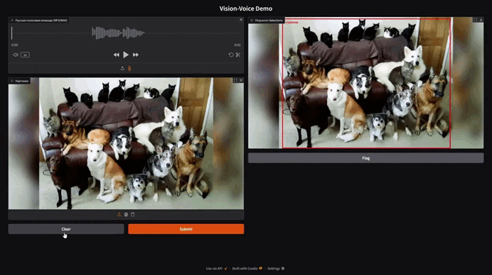

# 🐶🎙️ Vision‑Voice Demo

[](https://hub.docker.com/)
[](https://colab.research.google.com/drive/12o8ZhVKbKLouI-72SHGj2KamXH0RZayq?usp=sharing)
[](LICENSE)

> **MVP‑прототип:** по **русской** голосовой команде ищет указанный объект на картинке и подсвечивает его bounding‑box’ом.
> Работает *полностью офлайн* и *на CPU*.

<p align="center">
  
</p>

---

**Vision-Voice Demo** — это больше, чем технический прототип. Проект демонстрирует, как нейросети могут **реально упрощать жизнь людей** и решать конкретные задачи в самых разных сферах:

### Решение актуальных задач:

* **Помощь людям с ограниченными возможностями**
  Люди с нарушениями зрения или моторики смогут упростить взаимодействие с фото, каталогами и даже пространством вокруг себя.

  > *«Покажи дверь», «Найди телефон», «Где кружка?» — простые команды, значительно облегчающие быт.*

* **Интерактивное изучение языка детьми (инвазивное обучение)**
  Продукт может быть адаптирован для детей, изучающих иностранный язык. Ребёнок произносит слово, а система показывает соответствующую картинку или объект. Так ребенок одновременно тренирует произношение и визуальную память.

  > *«Покажи машинку», «Найди котика» — голосовой интерфейс вовлекает и делает обучение естественным.*

* **Удобство для складов и логистики**
  Голосовая навигация и поиск по изображениям ускоряет работу сотрудников на складах. Сотрудник называет предмет голосом — нейросеть находит его на фото склада или даже на камере в реальном времени.

  > *«Где коробка №5412?» — поиск, который ускоряет рабочие процессы в десятки раз.*

* **Обучение новых моделей детекции**
  Проект легко масштабируется под задачи бизнеса или исследовательские цели. Вы можете интегрировать собственный датасет, дообучить модель под ваши классы и использовать её в узких нишах: от автоматизации ритейла до мониторинга безопасности.


---

## Возможности

* **ASR:** `Whisper‑small` (через *faster‑whisper*)
* **RU→EN перевод:** `CTranslate2` INT8
* **Детекция + grounding:** `Florence‑2‑base` 8‑bit
* **Интерфейс:** Gradio — запускается одной командой
* **Offline‑режим:** модели скачиваются один раз скриптом или во время Docker‑build

---

## Быстрый старт

<details>
<summary>🔹 Docker (рекомендовано, полностью офлайн)</summary>

```bash
git clone https://github.com/USERNAME/vision-voice-demo.git
cd vision-voice-demo

# 1. Скачиваем модели (один раз)
bash scripts/download_models.sh

# 2‑а. Сборка образа (модели копируются внутрь)
docker build -t vision-voice-demo .

# 2‑б. ❗ Альтернатива — не тащить 3 ГБ в контекст:
#     docker build --build-arg MODELS_PATH=/host/models -t vision-voice-demo .

# 3. Запуск (UI откроется на http://localhost:7860)
docker run --rm -it -p 7860:7860 vision-voice-demo
```

</details>

<details>
<summary>🔹 Локально (Python≥3.11)</summary>

```bash
python -m venv .venv && source .venv/bin/activate
pip install -r requirements.txt
bash scripts/download_models.sh        # ~3 ГБ

python app/main.py                     # Gradio откроет браузер
```

</details>

<details>
<summary>🔹 Google Colab (GPU, облако)</summary>

Нажмите на кнопку «Run on Colab» в шапке — откроется ноутбук с тем же пайплайном, но на GPU. Модели подтянутся автоматически через `git lfs`.

</details>

---

## Архитектура

```text
     Voice (ru)            Image
         │                   │
         ▼                   ▼
┌────────────────┐    ┌────────────────┐
│ Whisper‑small  │    │ Florence‑2‑base│────────→Output
└────────────────┘    └────────────────┘
         │  ru text            ▲
         ▼                     │ grounded bboxes
┌────────────────┐             │
│ CTranslate2    │─────────────┘
└────────────────┘ en prompt
```

---

## Использование

1. Запишите голосовую фразу («Найди **собаку** на фото») или загрузите MP3/WAV.
2. Загрузите изображение.
3. Нажмите **Submit** — объект будет обведён красным прямоугольником.


---

## Скрипт скачивания моделей

```bash
# scripts/download_models.sh
git lfs clone https://huggingface.co/guillaumekln/faster-whisper-small whisper-small
git lfs clone https://huggingface.co/microsoft/Florence-2-base       florence-2-base
```

*Если размер Docker‑контекста критичен* — исключите `models/**` в `.dockerignore`
и примонтируйте папку как volume:

```bash
docker run -v "$PWD/models:/app/models" -p 7860:7860 vision-voice-demo
```

---

## Roadmap


* Поддержка большего количества языков и диалектов (multilingual ASR).
* Подключение камеры реального времени для работы с видео-потоком.
* Интеграция сервиса рекомендаций на основе распознавания объекта (например, автоматическое определение товаров и их цены).
* Реализация мобильного приложения или голосового ассистента для повседневных задач.
* Возможность «донаучивания» (fine-tuning) на собственных данных через простой интерфейс.

---

## Почему это важно?

Используя технологии голосового управления и детекции объектов, можно существенно повысить качество жизни и работы людей. Это **не просто интересный прототип**, а шаг к созданию интуитивных и естественных интерфейсов взаимодействия с техникой.

Проект открывает путь к созданию доступных продуктов, которые будут полезны **реальным людям** и смогут найти своё применение в самых разных отраслях.

---

## 📝 Лицензия

MIT. Используйте как угодно, но ⭐ репозиторию — лучшая благодарность.

Made with ❤️ and ☕
